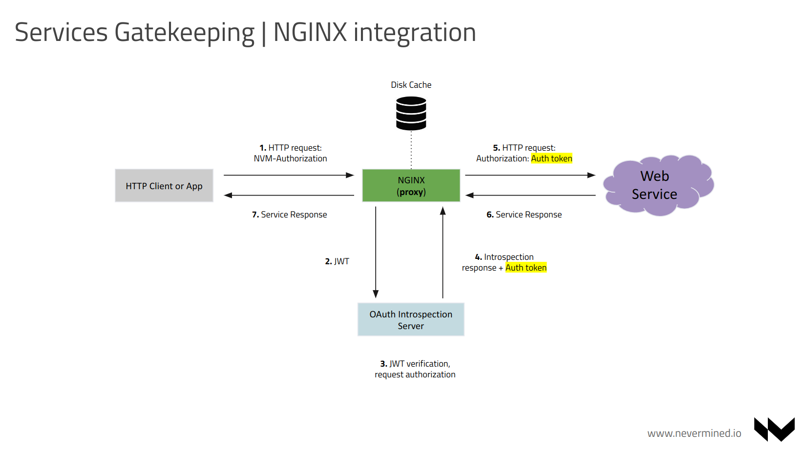

# Solution Architecture

This page describes how the tokenization of web services via Nevermined NFTs can be implemented.

This architecture is defined to implement the [use case and flows described in the documentation](user-flows.md).

## Nevermined Assets

In Nevermined all the assets registered in the network are composed by some off-chain metadata describing the asset and some on-chain registration.
To implement the tokenization via NFTs of web services it's necessary to manage 2 different kind of assets into Nevermined:

### Subscription

The subscription is an asset describing a susbcription that can be purchased/owned by a user. This subscription is backed up by a NFT contract (in the current implementation based on the ERC-721). A Nevermined subscription typically is an asset that can be purchased by a user for some price (or for free) and when that is done a NFT `tokenId` is minted and owned by the user purchasing that subscription. Because that user owns and can demonstrate that owns that `tokenId` some off-chain or on-chain components can provide access to exclusive resources to that user.

In Nevermined a NFT Subscription is described by some information:

* Metadata of the subscription describing it (title, price, duration, to what gives access, tags, etc). That helps to that subscription to be discovered and facilitate a purchase decision by the client.
* A ERC-721 NFT Smart Contract that list all the holders of tokens for the subscription. The NFT Smart Contract is owned by the user deploying the NFT subscription.

When a Nevermined Subscription is registered into the system by a Subscription Publisher, the following information needs to be registered into the system:

* The Metadata describing the subscription will be stored off-chain in a Marketplace API (can be stored into IPFS too). Beyond the information describing the subscription the metadata must include one service describing the conditions to purchase the subscription (aka `nft-sales`)
* The unique identifier of the subscription (Subscription DID) and the link to the Metadata will be registered into the `DIDRegistry` Smart Contract
* The Subscription NFT (ERC-721) Smart Contract

When a user discovers an interesting subscription (typically via Marketplace or similar application), that user can purchase a token of that Subscription NFT directly interacting with the Smart Contract.

### Web Service

The service requires an asset describing the web service provided to a user. The service is described in the asset metadata including:

* Service description
* Endpoints
* Service authentication (needs to be [added into the `files` section to be encrypted](https://docs.nevermined.io/docs/architecture/specs/Spec-METADATA#file-attributes))

When a Nevermined Service is registered into the system by a Publisher, the following information needs to be registered into the system:

* The Metadata describing the service will be stored off-chain in a Marketplace API (can be stored into IPFS too). Because the service can not be purchased directly and only can be accessed by the holders of a different asset (the NFT susbcription) the metadata of this service only will include an access service (`nft-access`).
* The unique identifier of the service (Subscription DID) and the link to the Metadata will be registered into the `DIDRegistry` Smart Contract

## NFT Access Control

When a user holds a token granting access to a service somehow this user should be able to demonstrate that. That action must happen in such a way is compatible with existing software interacting with HTTP web services. That limits the requirement of modifying client application to do Nevermined bespoke integrations, facilitating the adoption of the solution.

The NFT access control is designed around 2 standards: HTTP Proxies and Json Web Tokens (JWT):

* Every relevant HTTP client supports the configuration of proxies that give access to HTTP resources. Tradionaly HTTP proxies have been used to provide external access from a closed network or more recently to expose and centralize web services in the shape of API gateways.
* JSON Web Tokens (JWT) is an open standard (RFC 7519) that defines a compact and self-contained way for securely transmitting information between parties as a JSON. JWT can be serialized and added as HTTP headers to authenticate and authorize users and the access to resources.

Having into account these 2 concepts, from Nevermined we can provide a way to gate-keep the access to services to NFT holders via a bespoke HTTP proxy function. This proxy module needs to manage a JWT message including the following attributes:

* Subscription DID
* Service DID
* Client public address
* Endpoints
* Headers/Authentication required by the webservice

The authentication of the user can be implemented via the validation of the signature of the JWT. Having the public address of the client, the proxy can check if that address is a valid subscriber of the service via balance request to the NFT (ERC-721) Subscription Smart Contract.

If the client is NOT a subscriptor the proxy will return a HTTP 401 Unauthorized error message.
If the client is a subscriptor the proxy will parse the service description and check if the resource requested is included as part of the service. If it's the proxy will send the request to the external web service and return the response.

## Access Control to web services via Nevermined Proxy

The Nevermined Proxy validates that incoming requests are authenticated via OAuth 2.0 validation based on JSON Web Token (JWT) as defined by RFC 7519.

After authentication, a client presents its access token with each HTTP request to gain access to protected resources. Validation of the access token is required to ensure that it was  issued by a trusted identity provider (IdP) and that it has not expired. Because IdPs cryptographically sign the JWTs they issue, JWTs can be validated “offline” without a runtime dependency on the IdP. Typically, a JWT also includes an expiry date which can also be checked.

The standard method for validating access tokens with an IdP is called token introspection. RFC 7662, OAuth 2.0 Token Introspection, is now a widely supported standard that describes a JSON/REST interface that a Relying Party uses to present a token to the IdP, and describes the structure of the response. It is supported by many of the leading IdP vendors and cloud providers.

In this repository we achieved this functionality using 2 different alternate approaches, one using a bespoke proxy and another one using NGINX as reverse proxy. Using NGINX is more suitable for production environments because can protect more effectively the introspection requests, that are delegated to the OAuth Introspection server. That server has been implemented in Typescript and performs the JWT - JWE decryption, validation of the urls requested, and return of the authorization token required by the end web service to authorize the user request.

## Securing web services

If clients have direct access to web services any protection introduced by a proxy can be skipped. Because of that and specially for services running in a public network it's highly recommended to configure some protections:

* Implement OAuth service authorization protecting that service to be accessed by anyone not able to authenticate. Via the Nevermined service registration, the OAuth token can be encripted allowing that only the asset provider can provide a valid JWT header.
* Implement some **network protection** in the service or the access point to it. It is recommended to only allow requests comming from a trusted Nevermined proxy.

