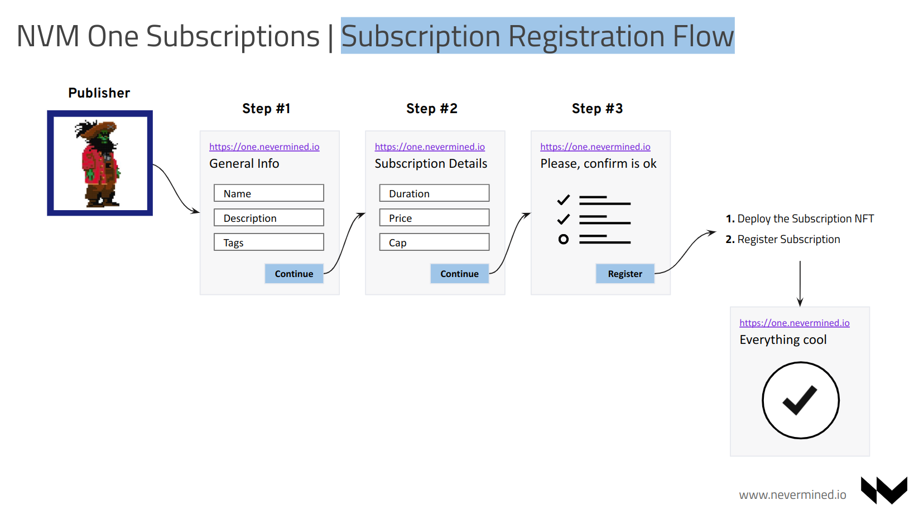
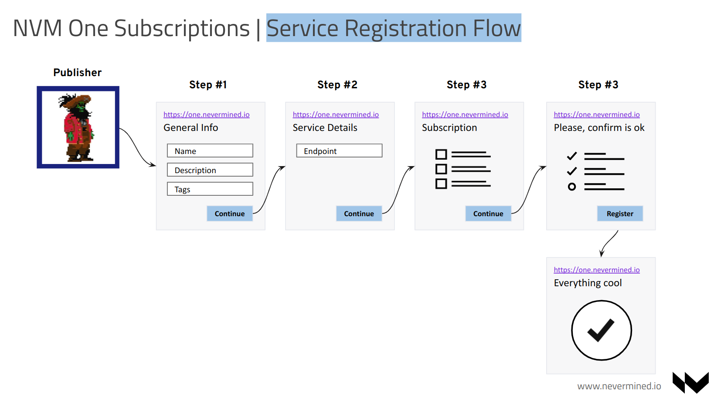
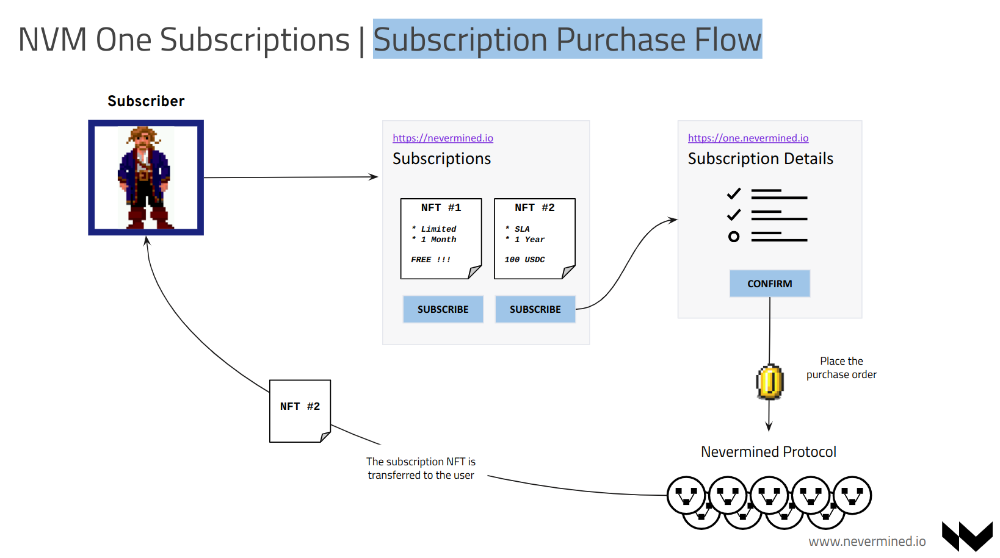
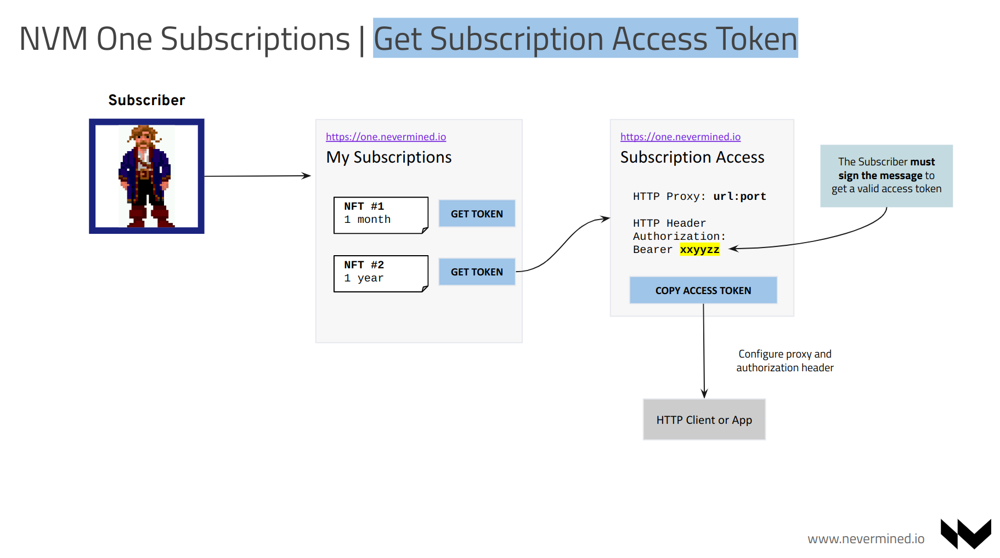
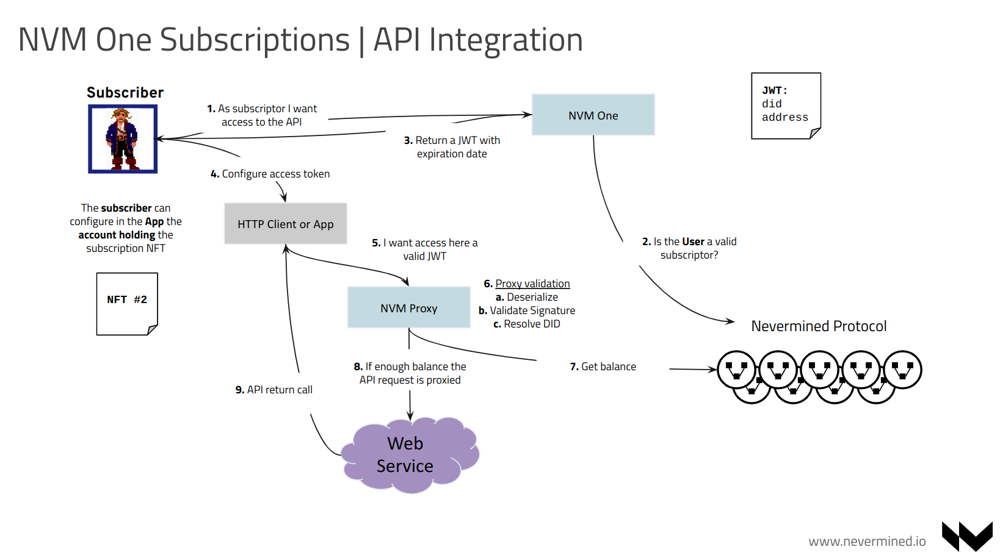

# User Flows

This page describes the potential user flows required to implement the end to end interactions of the Nevermined Proxy.

## Actors

We use the following actors:

* The Service Owner or **Publisher**. This actors owns/control a web service and wants to make it available under some 
  conditions (payment) to the rest of the world.
* The Service Consumer, Client or **Subscriber**. This actor wants to get access to the web service to integrate the data provided in 
  his/her application.

## End to End

The end to end flow since a service is defined in the system by the Publisher till is integrated by the Client, requires the following steps:

* The Publisher register a new Subscription in the system
* The Publisher register a new Web Service and associates it to an existing subscription NFT or creates a new one
* The Subscriber purchases the subscription
* The Subscriber get the access token associated to the subscription he/she owns
* The Subscriber configures the access token in the client application and get access to the Publisher API

### The Publisher register a new Subscription in the system

This is the flow used by the **Publisher** to register a new subscription NFT into Nevermined. This can be skipped if the user finds an already existing subscription
valid. After this flow the publisher will own a NFT subsciption contract that could be used to gatekeep the access to web services.
For this flow publisher should provide the following information:

* General information of the subscription (Name, Description, Tags)
* Details of the susbcription (Duration of the subscription, Price)

This process will deploy a new ERC-721 NFT Smart Contract owned by the publisher, and register a new asset into Nevermined (SUBSCRIPTION ASSET) representing that subscription.

### The Publisher register a new Web Service

This is the flow used by the **Publisher** to register a new web service into Nevermined. To facilitate the service discovery by the potential
clients, the publisher should provide the following information:

* General information of the service (Name, Description, Tags, URL to documentation, etc)
* Service Details (Endpoint of the service). We leave service authentication for a second phase.
* The subscription associated to the service from a list of the subscriptions owned by the publisher

This process will register a new asset into Nevermined (SERVICE ASSET) representing the web service the Publiher offers to the rest of the users.

With the service published and associated to a susbcription the publisher is done and don't need to do anything else.

### The Subscriber purchases the subscription

In this flow the client or **Subscriber** find the service (potentially via Marketplace) and wants to get access to it. Becase that web service only
can be accessed to subscribers, the client needs to purchase the NFT subscription. Typically the susbcriber will be able to see all the information provided by the publisher in the metadata, and purchase if is interested.

When the subscriber purchases the subscription (for free subscriptions the flow is the same), a new NFT susbcription will be minted and will be owned by the subscriber.

### The Subscriber get the access token

In this flow the **Subscriber** owning the subscription associated to his/her wallet can get a subscription access token that can be configured in a HTTP application to make requests. These requests because this access token can authenticate the sender of them as a subscriber, allowing to give access to remote resources.

Because the application sending the requests typically will be an HTTP client, the configuration to be applied must be standard in HTTP. To get access to the web services the configuration provided will include the following:

* A HTTP Proxy. Including the Proxy hostname and port
* A HTTP Authorization Header. The value of this header will be an encoded JWT including the following information:
  * DID of the Subscription owned by the user
  * DID of the Service to get access
  * The public key of the subscriber

As part of the JWT message this information will be signed by the subscriber to provide a valid message that can be authenticated and authorized later.

### The Subscriber get access to the remote web service

Having the proxy configuration and the HTTP authorization header, the client can configure an application with this information to consume the service.
All the requests will go through the Nevermined HTTP Proxy that will have the following responsibilitites:

1. Deserialize the JWT message
2. Validate the signature to authenticate the user
3. Resolve the subscription and service DIDs
4. Check if the subscription and service are associated. So owning the subscription gives access to the service
5. Check the balance of the subscription NFT. At this point the proxy has 2 options:
   a. Return a HTTP 401 Unauthorized error if the user don't have access/balance
   b. Proxy the user request to the final service. Add a NVM Auth header signed by the proxy

